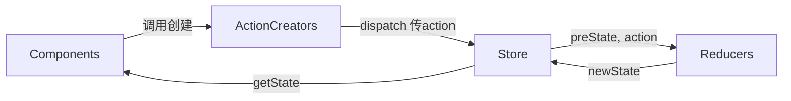

# React.js(18.2.0)

## 概念
* 构建Web应用的JavaScript库, 起源于Facebook
* 也可以开发移动端, vr应用

## 安装
* npm i react react-dom
    * react是核心包, 提供创建元素, 组件功能
    * react-dom提供DOM相关功能, 针对web应用, 其他环境使用对应的其他包
* script:
    * script标签引用时, 先引用react, 再引用react-dom
    * React.createElement(标签, 属性对象, ...子节点)用于创建元素, 用jsx会更方便
    * ReactDOM.render渲染react元素到指定dom中
        * React18中使用react-dom/client的createRoot创建根节点, 根节点.render(jsx)来渲染
* 脚手架:
    * npx create-react-app NAME 来创建项目
* chrome插件:
    * chrome商店搜索 React DevTools, 安装完打开react应用会出现components选项卡
* vscode插件:
    * 安装 React-Native snippets 使用rfc可以快速创建函数组件

### 文件结构
* public: 静态文件
    * ico: 项目Tab栏图标
    * index.html: 入口html文件
        * theme-color是Android手机地址栏颜色
        * apple-touch-icon将网页添加到手机主屏的图标
        * manifest.json加壳(作为手机app)的图标,权限等
* src: 代码
    * React.StrictMode: 包裹App, 进行检查
    * reportWebVitals: 性能分析

### 代理配置
* 解决跨域问题(跨域是请求正常发出, 但是不接收), 代理就是在当前端口开启服务进行转发(由于转发不是用ajax引擎不存在跨域问题)
* 可以在package.json添加proxy属性, 设置一个url指定ip和端口号(不写后续具体路径), 对当前端口不存在的资源进行代理
* src路径创建setupProxy.js文件配置代理
    * require('http-proxy-middleware') 导入代理包
    * 暴露一个方法, 参数是app, 内部执行app.use(proxy1, proxy2...)
        * proxy参数为(要代理的路径, 代理的配置)
        * 配置.target 代理后路径
        * 配置.changeOrigin 默认false, 控制服务器接收header中host的值, 可以解决服务器同源限制
        * 配置.pathRewrite 将请求路径进行替换

## JSX
* JavaScript XML, createElement的语法糖, 最终生成react元素
* 不是标准的ECMAScript语法, 是扩展, 依赖于babel编译处理(@babel/preset-react)
* 使用驼峰命名, class=>className, for=>htmlFor
* 推荐使用小括号括起来
* 使用{}括起来js表达式, 注意需要是表达式, jsx本身也是表达式
    * 对象不是合法的值, 一般只出现在style属性中, style中对象属性也是驼峰命名
    * 逻辑语句由于不是表达式不能直接写入jsx, 但是可以调用方法, 所以可以写在方法中并调用
    * 数组注意列表元素加key属性, 且避免索引作为key
* jsx的注释用{}括起来形成js表达式, 然后再用js注释
* jax需要将内容包裹在一个节点内
    * 可以使用<></>这样的空标签包裹而不被渲染
    * 可以使用React.Fragment组件包裹内容, 而Fragment组件不被渲染, 相对于空标签可以设置key值用于遍历

## 组件

### 函数组件
* 大写字母开头的函数名, 有返回值(返回null表示不渲染内容), 函数名作为标签名

### 类组件
* 类名大写, 继承React.Component, 提供render方法且有返回值, 类名做标签名

### 事件
* 使用on+事件名主持监听, 事件名也是驼峰命名, 使用的是合成事件对象, 兼容多浏览器
* 注意this的指向
    * 可以通过箭头函数包裹监听事件修改this指向
    * 可以this.eventName.bind(this)修改this指向, 可以写在构造方法中
    * 在定义方法时使用 eventName = () => {} 来定义箭头函数(推荐使用)

### 状态
* 状态(state)就是数据
* 函数组件是无状态组件(固定渲染内容), 类组件是有状态组件(渲染内容存在互动)
* state是一个对象, 组件内部使用, 通过this.state.XXX访问
* 构造函数中进行this.state初始化, 或者直接state = {}来初始化
* this.setState({key: val}) 来修改状态同时触发react更新UI的操作, 不要直接this.state.XXX=XXX修改
* setState是异步更新的, 即直接在setState后取值是未更新状态
* 多次setState只会render一次
* 推荐使用: setState((state, props) => {a:x}) 使用回调函数参数来赋值, 函数中参数为最新的state和prop值, 即前一次setState会反映到参数中
* setState((state, props) => {a:x}, callback) 在更新完state(所有setState执行完, dom更新完)后执行callback回调
    * 类似于componentDidUpdate, 但是componentDidUpdate先于callback执行

### 受控组件(推荐使用)
* 值受到react控制, 将state值绑定到属性上(value/checked), 并添加监听来setState

### 非受控组件
* 值不受到react控制, 由DOM自身控制, 借助ref属性取值
* 构造方法中通过React.createRef()创建ref对象保存到this上, 将ref对象设置到元素的ref属性上, 后续通过this.ref对象.current.value取值
* (不推荐, 要废弃)可以直接为ref属性指定一个字符串名字, 通过this.refs.名字取得对应的元素
* (也不如createRef好)ref属性设置回调函数, 参数为当前元素, 绑定到this的属性上(内联写法(直接写在jsx中)更新时执行2次, 第一次参数为null)

### 组件间通信

#### props
* 组件调用时添加属性, 例如name='liy'
* 类组件内部通过this.props取得所有参数, 例如 this.props.name 取得'liy'
    * 构造函数中, 如果不声明props参数且不写super(props), 那么当前构造函数内取不到this.props, 而不会影响render等后续方法使用
* 函数组件内部通过参数取得, 参数名任意, 例如 param.name 取得'liy'
* 可以传递值, 函数, jsx
* props是只读的

##### props.children
* 调用组件时, 标签中的内容(类似vue的插槽)
* 可用类型和props相同
* 同理, 设定children属性会使其出现在标签中

##### props校验
* 指定props的类型, 格式等
* 依赖 prop-types 包
* 指定组件的 propTypes 属性, 为{name: valid}格式
    * 其中valid为 PropTypes.array 等格式
    * 必选项为.isRequired, 例如 PropTypes.array.isRequried
    * 特定结构通过shape指定, 例如 PropTypes.shape({name: PropType.string})

##### props默认值
* 组件.defaultProps设置默认值

#### 父=>子
* 父组件调用子组件时添加属性
* 子组件通过props取得参数

#### 子=>父
* 父组件调用子组件时, 属性传递了一个父组件的方法
* 子组件调用父组件传递过来的方法, 并携带参数

#### 兄=>兄
* 将 兄=>兄 拆分为 子=>父 + 父=>子
* 由共有的父组件来管理状态, 在父组件提供修改状态的方法

### 跨组件通信

#### context
* 使用 context(上下文)传递, 不常用, 主要用于封装插件
* React.createContext创建Provider(提供数据)和Consumer(消费数据)组件, 只有创建时的一对才能对应取数据
* 使用Provider组件作为根节点, 设置value属性来提供数据
* 取值时有2种方式
    * 使用Consumer组件包裹, children部分写回调函数来获取value参数
    * 也可以在类组件直接声明 static contextType = 前文创建的context对象, 来为组件的context属性赋值

#### pubsub-js
* 订阅发布模式
* 订阅: PubSub.subscribe('事件名', callback), callback参数为(事件名, 数据), 订阅时返回token, 卸载时取消订阅(PubSub.unsubscribe(token))
* 发布: PubSub.publish('事件名', 数据)异步发布 / PubSub.publishSync('事件名', 数据)同步发布

### 生命周期
* 创建, 运行, 卸载的过程, 对应不同的钩子函数
* 类组件有生命周期, 函数组件没有声明周期

#### 创建阶段
* constructor: 创建组件时执行, 执行初始化操作(state, 方法绑定this)
* render: 渲染画面时触发, 调用setState会出现警告
* componentDidMount: 组件挂载完成后, 可以进行DOM操作了, 可以发送网络请求

#### 更新阶段
* 触发更新条件:
    * props变更
    * setState
    * 调用forceUpdate方法强制更新
* shouldComponentUpdate: 控制组件是否需要更新, 参数为要更新成的props和state, 此时this.state为未更新值, 返回true为需要更新
* render: 和创建时一致
* componentDidUpdate: 组件重新渲染完毕, 能操作DOM, 可以发送网络请求, 可以调用setState, 但是需要有条件判断, 防止死循环
    * 参数可以取得上一次的props, this.props是当前props

#### 卸载阶段
* componentWillUnmount: 卸载(从DOM移除)前调用, 能操作DOM, 一般执行清理操作, 比如定时器
    * 手动添加的监听, 例如window.addEventListener也要移除
* 手动调用 React-dom.unmountComponentAtNode(dom元素) 可以卸载指定dom上的组件
    * 高版本中, index将createRoot创建的root对象暴露出去, 使用root.unmount()去卸载

#### 不常用周期
* componentDidCatch: 特殊的生命周期, 渲染子组件报错时调用, 可以用于统计异常

### 组件复用
* 要复用的是状态(state)和逻辑(何时setState)

#### render props模式 
* 通过props传入返回渲染内容的方法
    * 通过props传入方法, 由组件内部调用并传入参数
    * 方法内部处理后的返回值做为要渲染的内容
* 通过children指定渲染内容比直接用props更直观
    * 由于children可以写jsx, 即可以写方法, 等价于从props传入方法
    * context的consumer就是children写法来指定渲染内容的
* 可以通过propTypes添加校验, 指定children为func.isRequired
* 本质是通过回调将复用组件props暴露给泛化组件

#### (HOC)高阶组件
* Higher-Order Component, 包装模式, 规定以with开头, 由于参数是组件, 所以参数大写开头
* 是一个函数, 参数是要包装的组件, 返回包装后的组件
    * 复用组件内部创建一个组件, 该内部组件render方法调用泛化组件, 将state作为props传递, 最后返回内部组件
* 由于多次调用返回的都是内部创建的组件, 会在ReactDeveloperTools中显示同一个组件名, 可以设置displayname区分(目前看高版本工具可以直接显示包装下的组件名)
* 注意将高阶组件的内部组件的props向下传递, 防止调用时指定的props丢失
* 本质是将复用组件作为泛化组件的父组件来传递props

### 纯组件
* 使用class创建组件时, 不再继承 React.Component, 而是继承 PureComponent
* 内部自动实现了 shouldComponentUpdate 方法, 不再需要手动对比优化
    * 对比了props和state, 有更新才重新渲染
    * 浅比较(shallow compare), 简单类型没有问题, 引用类型只会比较内存地址

### 组件更新
* 一个组件重新渲染时, 会重新渲染其所有子组件树(深度遍历方式)
* 通过 shouldComponentUpdate 判断当前组件是有要重新渲染
* 局部DOM更新, 不是所有DOM重新渲染(虚拟DOM配合diff算法)
    * 虚拟DOM就是react元素, 描述UI内容, render方法调用后生成
    * 初始化时, 通过state生成虚拟DOM树, 再渲染到浏览器中为真实DOM
    * 更新时, 根据最新state创建新的虚拟DOM树, 执行diff找到要更新的内容, 局部更新浏览器中真实的DOM
    * 虚拟DOM真正价值是让React脱离浏览器环境限制
* 由于真实DOM的局部更新, 所以setState调用render方法后, 浏览器未必重新渲染, 只意味着执行了diff算法

#### key
* 虚拟dom的标识
* diff时, 先通过key进行匹配, 找到旧的虚拟dom来进行对比
    * 找到了没差异不更新, 有差异新生成dom并替换旧dom到画面
    * 没找到直接重新渲染一个新的dom到画面
* 所以能操作的list不要用index作为key

### 组件优化
* state只存储渲染相关数据, 防止无关数据更新导致重新渲染
    * 无关数据可以直接挂到this上
* 通过 shouldComponentUpdate 防止无关重新渲染
* 使用纯组件, 注意浅比较的坑

## Antd
* 样式组件库, 蚂蚁金服出品
* 建议按需引入, 减少代码量
* 可以自定义主题等内容

## 打包
* package.json的build命令
* 使用serve包可以快速将一个文件夹指定成服务器根目录
    * serve PATH指定路径 --PORT指定端口

## 错误边界
* 保证错误控制在一定范围内不会蔓延, 即部分组件出错不影响其他内容
    * 适用于生产环境
* (类组件)声明getDerivedStateFromError方法, 在子组件报错时调用该方法
    * 参数是错误内容
    * 返回的对象更新到state中
    * 只能捕获生命周期中的报错

## 路由
* 点击链接引起路径变化, 被路由器检测到, 完成视图(页面)导航, 就是通过URL映射到组件(前段路由)或方法(后端路由)
* 路由(route)由路由器(router)管理

### 安装
* npm i react-router-dom
    * react-router: 核心库, 包含组件和钩子
    * react-router-dom: 包含核心库, 针对web应用提供组件
    * react-router-native: 包含核心库, 针对nativeApi组件

### router5

#### history
* 历史记录是栈结构
* 前端路由借助BOM.history实现
    * DOM文档对象, BOM浏览器对象, 后者包含history信息
* 借助history包操作历史更方便
    * push 向历史记录添加一条path, 而最后一条记录就是当前显示内容, 即当前显示的url会变更
    * listen 监听路径变化, 参数是当前路径
    * replace 替换path, 由于是替换, 导致前一个页面无法通过后退键返回
    * goBack/goForward 后退/前进
* browserHistory: h5推出的history新api, 低版本浏览器不兼容后退前进按钮
* hashHistory: 使用hash值(锚点(href='#path'), 即路径带#, 锚点也会引起history变化)
    * #号后面的hash值不会作为资源发送给服务器

#### Router
* 路由器, 分为BrowserRouter和HashRouter, 对应上文的history中内容
    * 由于BrowserRouter使用H5的history api, 所以state传参时刷新页面可以保持, 使用比hash多
    * 而HashRouter没使用history api, 导致state传参刷新时丢失
* 用于包裹Link组件和Route组件, 一套标签和组件用一个路由器包裹(直接包裹app)
    * Link: to属性指向要去的路径(不要大写), 会渲染成a标签
        * NavLink: Link是强化版, 选中的会添加active属性, 可以使用activeClassName来替换默认的active属性
        * 项目中的标签属性可能相同, 可以封装成组件来包装NavLink
    * Route: 用于指定路径(path)和组件(component)对应关系
        * 一个path路径可以匹配多个组件, 即每个Route都会执行一次匹配, 为了效率使用Switch组件
        * Redirect重定向组件, 写到路由的最下方, 通过to属性指定默认路由

#### 路由组件
* 由路由Route进行匹配来展示的组件, 放入pages路径
    * 一般组件: 由<组件名/>形式引入的组件, 放入components路径
        * 引入withRouter方法, 使用withRouter包裹一般组件, 使其拥有路由组件的props(这不就是高阶组件么...)
* 路由组件携带了指定的props, 一般组件手动指定props
    * history
        * history.location等价于同级的location
        * history.go 前进/后退几步
        * history.goBack 后退一步
        * history.goForward 前进一步
        * history.push 添加指定path, 前页面有历史记录
        * history.replace 替换指定path, 前页面无历史记录
    * location
        * location.pathname 当前路由路径
        * location.search search传参
        * location.state state传参
    * match
        * match.params params传参
        * match.path 当前路由路径
        * match.url 当前路由路径

#### 样式丢失
* localhost:3000映射为public文件夹, 不存在的路径映射为index.html
* (BrowserRouter)路由跳转时, 导致路径变化, 刷新后使用绝对路径引入资源会拼接到变更路径后, 无法匹配
    * 写相对路径
    * 使用 %PUBLIC_URL% + 路径, 其值为localhost:3000/public
    * 使用 HashRouter, 因为#后内容不传递

#### 模糊匹配
* 无法完全匹配的路径会去掉最后一层路由再次匹配, 递归到顶层或匹配到为止
* 精准匹配, 添加exact属性或者设置exact为true即可开启, 只能完全匹配才显示
    * 可能导致无法匹配二级路由
* 推荐在模糊匹配有问题时再开启精准匹配

#### 嵌套路由
* 路由注册记录先后顺序, 匹配的顺序根据注册时的顺序
    * 所以嵌套路由要包含前面层的路由, 不然父组件无法匹配

#### 路由传参
* params模式: Link的to属性使用PATH/p1/p2...形式传递参数列表, Route的path属性使用PATH/:p1/:p2...形式, 存储在props.match.params属性上
* search模型: Link的to属性使用PATH?P1=A&P2=B...形式传递参数列表, Route的path属性不需要额外写内容, 存储在props.location.search属性上
    * 通过querystring库解析, 通过parse/stringify完成对象和urlencode映射, 注意search携带了?字符
* state模式: Link的to属性使用一个jsx的对象, pathname为原来的to路径, state属性为一个参数对象, Route的path属性不需要额外写内容, 存储在location.state属性上
    * 相对于前两者, 不会显示在路径上, 隐藏了信息
    * 由于state在location上, 而location在history上, 所以刷新内容不会消失

#### push/replace
* 默认使用push操作, 留下痕迹
* Link组件添加replace属性, 使用replace模型

#### 编程式路由
* 借助this.props.history上的方法实现路由跳转
* replace/push函数的参数是(path, state)形式
* go代表前进还是后退几步, 负数代表后退

#### 懒加载
* 默认直接加载所有路由组件
* 从react引入lazy方法, 调用lazy函数传入回调, 回调内执行import('PATH')加载路由组件
* 从react引入Suspense组件包裹路由, 指定fallback属性, 在组件未加载完时显示对应的内容
    * 可以是组件或者jsx等形式
    * fallback指定的内容不能是懒加载得到的

### router6

#### Router
* 使用时也是先使用路由器(BrowserRouter/HashRouter)包裹组件
* 使用Link/NavLink组件作为标签
    * 5版本NavLink组件使用activeClassName修改active类名, 而6版本需要将class指定为函数形式, 参数为{isActive:true/false}, 自定义返回值作为className
    * end属性用于在点击子路由时, 当前路由非active
* 5版本的包裹Route的Switch组件废弃, 给用Routes组件, 同样会使path只匹配一次(后续短路)
    * Routes是必须的, 而5版本的Switch是可选的
    * 5版本的Redirect废弃, 6版本使用Navigate
        * 使用时还是Route组件, path指定默认路径(就是/), element指定Navigate组件, 且该组件to指定了默认path(例如to='/home')
        * 和Redirect效果一样, 都会导致路径切换,
            * 可以单独作为切换路由使用, 在组件内渲染Navigate就会切换路径
        * 默认replace属性是false, 即默认push切换, 设置replace就变成替换了
* 5版本Route的path继续沿用, 而component属性替换成了element属性
    * 5版本component直接写组件变量, 而6需要在element属性中写标签形式的组件
    * 新增caseSensitive属性, 用于设置是否区分大小写, 默认false

#### 路由表(useRoutes)
* 用于生成等价于Routes组件写法的jsx, 可以将路由表放入单独文件
    * 参数是数组(路由表), 元素是对象, key分别是path和element
        * 可选属性children, 代表嵌套路由, 值的格式就是路由表格式
        * 此时path可以只写当前路径, 而用/开头表示绝对路径

#### 嵌套路由
* Link/NavLink的to同样也可以不用/开头写当前路径(等价于./)
    * 只有Link/NavLink可以用./, 而路由表不可以
* 使用路由表时, 嵌套路由配合Outlet组件来指定路由组件渲染位置

#### 路由传参
* params模式: 
    * 传值方式和5版本相同, 在to直接拼接内容(to=PATH/id/name), 在path以PATH/:id/:name...形式声明
    * 接收时使用 useParams Hook来接收, 无参直接返回params
    * 也可以使用 useMatch Hook来解析路径, 需要传入path上的路径, 返回5版本的props.match同样的对象
* search模式:
    * 传值方式和5版本相同, 在to拼接urlencode(to=PATH?id=1&name=2), path只需要PATH即可
    * 接收时使用 useSearchParams Hook来接收, 类似useState, 返回一个数组, 分别是search参数和更新search参数方法
        * search可以调用get方法, 传入key来取得对应value
        * 更新search方法传入urlencode形式字符串, 影响path显示, 影响画面解析到的search内容, 不会影响父组件
    * 同样可以使用 useLocation Hook来解析
* state模式:
    * 传值模式就和5不同了, 将原来to属性拆分为to和state属性, 分别写路径和数据
    * 接收时使用 useLocation Hook来取得state属性

#### 编程式路由
* 使用 useNavigate Hook来取得方法
    * 第一个参数可以传入字符串的路径完成跳转, 注意/绝对路径的问题
    * 第二个参数是配置属性
        * replace指定插入还是替换history, 默认false
        * state表示state传参携带的数据
    * 直接传入数字相当于5版本的history.go
* 5版本一般组件使用withRouter包裹才能使用路由API, 而6版本可以直接使用useNavigate Hook

#### 其他不常用Hook
* useInRouterContext 判断组件是否在路由器(router)中, 注意不是区分一般组件和路由组件
* useNavigationType 返回用户如何来到当前路径, 返回POP(直接打开该路径/刷新页面)/PUSH/REPLACE
* useOutlet 返回当前组件下嵌套的其他路由, 挂载了才有值, 未挂载null
* useResolvePath 解析路径为 pathname, search, hash 形式

## Redux
* 状态管理的js库, 而不是react插件库(也可以支持vue,angular)
* 集中式管理多组件共享的状态
    * redux是独立于react组件的, 将需要共享的状态从组件管理交由redux管理, 组件自用的数据仍然自己管理
* 目前建议使用 @reduxjs/toolkit 包, 内置了immutable.js插件

### redux(旧版)

#### 安装
* npm i redux

#### 原理
* Components 调用 ActionCreators 得到action对象
    * action对象包含type和data对象, type是字符串且唯一, data是任意类型的可选属性
    * action是对象就是同步action, action是方法就是异步action
        * 返回的方法第一个参数为dispatch方法, 内部调用同步action
* 执行 dispatch 方法, 参数是action对象, 传递给 Store
* Store 将接收的action对象交给 Reducers 执行对应操作, 除了传递action还传递了之前一次状态
    * 初始化时, 之前状态传的undefined
* Reducers 处理结束后, 返回新的状态给 Store
* Components 调用 getState 方法取得最新状态

#### 纯函数
* 一样的输入, 得到的输出是一样的(引用型内容一样就算一样)
* reducer需要是纯函数
* 纯函数有如下约定:
    * 不改写参数数据
    * 不产生副作用(可能出异常), 例如网络请求, IO
    * 不能调用非纯函数, 例如Date.now()/Math.random()
* 高阶函数: 参数是函数, 或者返回值是函数

#### 创建
* 创建一个方法作为reducer, 参数为当前state和action
    * 方法内部使用action.type进行处理, 返回值为处理后的state
    * 要为state设默认值
    * 第一次调用为store调用进行初始化, state传入undefined
* 引入createStore创建store对象, 传入上一步创建的reducer作为第一个参数
    * 需要使用 redux-thunk 中间件, 在createStore第二个参数, 使用redux.applayMiddleware(thunk)开启异步action的支持
    * 使用多个reducer时, 调用combineReducers方法, 将多个reducers合并的结果放入第一个参数
        * 使用键值对, key是组件state对应的key, value是组件的reducer
* 可以将action的创建写成函数单独放在一个文件中

#### 使用
* 引入自己创建的store, 调用store.dispatch, 传入action对象, 触发对应的reducer
* 挂载后使用store.subscribe监听store的变化, 注册回调, 回调内部调用setState
    * redux状态变化不会引起页面刷新, 手动setState执行render
    * 可以把dispatch写到index中去重新调用主render
        * redux使用浅比较, 引用型只比较了索引, 索引没变就认为数据没变
* 使用store.getState取得state

#### 开发工具
* Redux DevTools, 需要安装 redux-devtools-extension 包
* 从该包中引入composeWithDevTools传入creatStore第二个参数
* 如果设计中间件, 将中间件作为composeWithDevTools参数

#### 配合react-redux使用

##### 安装
* npm i react-redux

##### 概念
* UI组件应该被容器组件包裹
* 容器组件可以使用redux的api
* UI组件不和redux交互, 而利用props和容器组件交互, 接收和改变值
* 由于使用props传入state的值, 所以redux.store.state的变更会反映到画面自动刷新

##### 容器组件
* 从react-redux引入connect方法, 执行connect(f1, f2)(c1)返回一个容器组件
    * f1 该函数参数是state, 返回值作为props属性, 称为mapStateToProps
    * f2 该函数参数是dispatch, 返回值包含了操作store的方法, 称为mapDispatchToToProps
        * 可以简写成对象格式, key是传入props的方法名, value的createAction方法
    * c1 UI组件
* 画面直接渲染容器组件, 设置store属性为store对象
* 容器组件和UI组件可以写一个文件里

##### Provider
* 使用Provider组件设置store属性, 包裹其他组件, 为内部容器组件提供store对象

### react-redux+@reduxjs/toolkit

#### 安装
* npm i react-redux @reduxjs/toolkit

#### 创建
* 通过createSlice创建slice对象
    * 设置name属性, 命名空间, 追加到type之前, 防止冲突
    * 设置默认值initialState
    * 设置reducers属性, 指定对应key和操作(参数是state和action)
        * state就是slice的state, 结构和init时相同
        * action是proxy的对象, 包含type和payload属性
        * 方法内部操作state的属性, 不需要返回值
    * 通过.reducer属性导出reducer, 为store所用
    * 通过.action到处slice中的reducers的方法, 为dispatch使用
* 引入configureStore并调用, 创建store对象, 添加reducer属性
* 引入Provider组件(从react-redux), 包裹App组件, 并设置store属性为store对象

#### 使用
* 组件引入useSelector和useDispatch(从react-redux)
    * useDispatch用于创建dispatch对象, 通过dispatch(action方法())来触发reducer
        * 调用action方法时, 传入的数据会赋值给action参数的payload属性
    * useSelector传入一个方法, 该方法参数是state, 返回要取得的属性, 该属性名为store中创建reduce指定的key
        * 取得对象是slice的state

#### 异步action
* slice文件内创建并暴露一个方法
    * 参数payload
    * 返回值是一个异步函数
        * 参数是dispatch和getState方法
            * dispatch就是触发时的dispatch
            * getState方法返回值是store的state
        * 内部调用参数的dispatch执行指定的action

#### 开发工具
* Redux DevTools直接可以使用, 不需要额外配置

## Hook
* React 16.8新增特性, 在函数组件也可以使用state(即React更推荐函数组件了)
* 目前主推

### useState
* 让函数组件可以拥有state
* 参数是初始化的值
* 返回值是数组, 数组第一项是取得state, 第二项是为setState方法
    * 该setState同样可以使用对象赋值或者回调赋值, 但是不支持第二个回调参数
* useState只有第一次执行时对state初始化

### useEffect
* 让函数组件可以拥有生命周期
* 第一个参数是函数, 在初始化以及状态变化时调用该函数, 该参数返回的函数作为 componentWillUnmount
* 第二个参数是要监测的对象的数组, 不传入时默认监测所有对象
    * 空数组相当于 componentDidMount    
    * 不传入或者传入state相当于 componentDidMount + componentDidUpdate

### useRef
* 让函数组件可以拥有ref容器
* 调用该函数创建ref容器并赋值给元素的ref属性
* 取值时依旧使用ref容器.current

